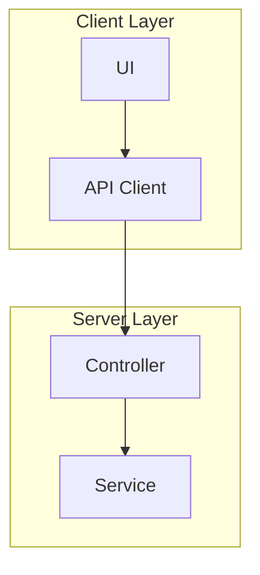
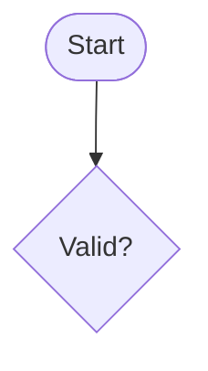
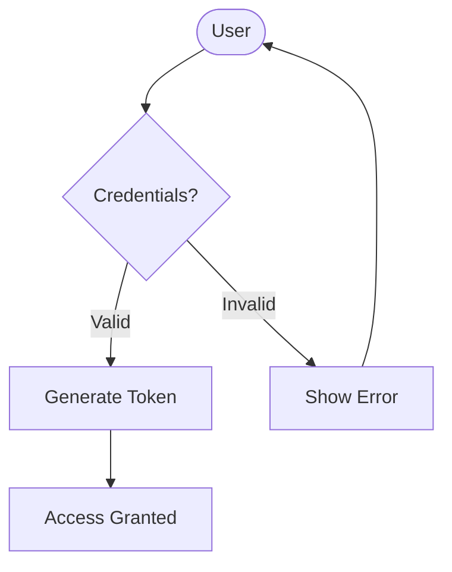
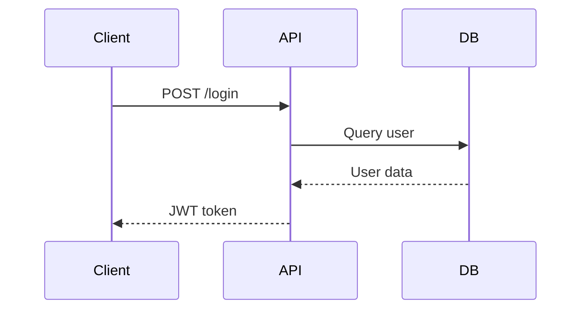
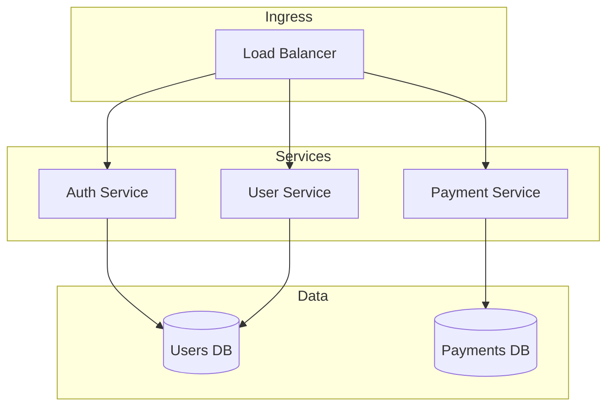

# IMPORTANT

this skill will be actived ONLY by the subagent meirmaid-diagram-builder (C:\Users\JOSE\.claude\agents\meirmaid-diagram-builder.md)

# Mermaid Diagram Design

Specialized skill for creating and modifying Mermaid diagrams with best practices and error prevention.

## When to Use

- User asks to create a diagram (flowchart, sequence, class, ER, etc.)
- User asks to modify or update an existing diagram
- User mentions visualization, schema, architecture, or structure
- File has `.mermaid` or `.mmd` extension
- Working with the meirmaid.py module

## Mermaid Best Practices

### 1. **Always Add Direction Markers**

For flowcharts, always specify direction:

```mermaid
%% GOOD
flowchart LR
  A[Start] --> B[Process]

%% GOOD
flowchart TD
  A[Start] --> B[Process]

%% BAD - no direction
graph
  A --> B
```

### 2. **Use Consistent Naming Conventions**

- Use `PascalCase` for nodes: `UserProcess`, `DatabaseHandler`
- Use `snake_case` for IDs: `user_process`, `db_handler`
- Keep names short but descriptive (max 20-30 chars)

### 3. **Label Nodes Clearly**

Always provide clear labels in brackets:

```mermaid
%% GOOD
A[User Authentication]

%% OK for simple cases
B[Auth]

%% BAD - unclear
A[UA]
```

### 4. **Group Related Elements**

Use subgraphs for organization:



### 5. **Use Appropriate Arrow Styles**

- `-->` : Standard flow
- `==>` : Bold/main flow
- `-.->` : Dotted/optional flow
- `~~~` : Inverse flow

### 6. **Add Comments for Clarity**



## Common Errors to Avoid

### ❌ **Syntax Errors**

1. **Missing closing brackets**
   ```mermaid
   %% BAD
   A[Open node

   %% GOOD
   A[Closed node]
   ```

2. **Invalid characters in IDs**
   ```mermaid
   %% BAD - spaces in ID
   node 1 --> node 2

   %% GOOD - spaces in label only
   node1[node 1] --> node2[node 2]
   ```

3. **Unmatched parentheses in subgraphs**
   ```mermaid
   %% BAD
   subgraph Name
     A --> B

   %% GOOD
   subgraph Name
     A --> B
   end
   ```

### ❌ **Structure Errors**

1. **Missing direction indicator in flowcharts**
   ```mermaid
   %% BAD
   flowchart
     A --> B

   %% GOOD
   flowchart LR
     A --> B
   ```

2. **Self-referencing nodes without clear notation**
   ```mermaid
   %% Use loop notation instead of unclear self-references
   A -->|retry| A
   ```

3. **Overlapping arrows without labels**
   ```mermaid
   %% BAD - unclear which path to take
   A --> B
   A --> B

   %% GOOD - labeled paths
   A -->|success| B
   A -->|retry| B
   ```

### ❌ **Visual Clarity Errors**

1. **Too many nodes in one diagram** (>20 nodes = consider splitting)
2. **Lines too long** (use intermediate nodes)
3. **Inconsistent styling** (stick to one style per diagram type)

## Diagram Type Selection

Choose the right diagram type for your purpose:

| Purpose | Diagram Type | Example |
|---------|--------------|---------|
| Process flow | `flowchart` | Business logic, algorithms |
| Time sequence | `sequenceDiagram` | API calls, user interactions |
| Class structure | `classDiagram` | OOP design, database models |
| Database schema | `erDiagram` | Table relationships |
| State transitions | `stateDiagram-v2` | State machines, workflows |
| Timeline | `gantt` | Project schedules, milestones |
| Hierarchy | `pie` or `mindmap` | Distributions, categories |

## Integration with meirmaid.py

The mermaid module supports:
- **Extensions**: `.mermaid`, `.mmd`
- **Render mode**: Diagram with Mermaid.js
- **Edit support**: Yes (via webhook)
- **Input type**: Text descriptions

### Working with meirmaid.py

When creating diagrams for the meirmaid module:

1. **Use proper file extensions** (`.mermaid` or `.mmd`)
2. **Add descriptive headers** as comments
3. **Keep diagrams self-contained** (no external dependencies)
4. **Test basic syntax** before saving

## Diagram Creation Workflow

### Step 1: Understand Requirements

Ask clarifying questions:
- What type of diagram? (flowchart, sequence, etc.)
- What's the main process/system being shown?
- Who is the audience? (technical, business, mixed)
- Any specific style preferences?

### Step 2: Draft Structure

1. List main components/nodes
2. Identify relationships/flows
3. Group related elements
4. Plan the layout (LR, TD, etc.)

### Step 3: Create Diagram

1. Start with type declaration and direction
2. Add nodes with clear labels
3. Connect with appropriate arrows
4. Add subgraphs if needed
5. Include comments for context

### Step 4: Validate

Check for:
- ✅ Syntax correctness
- ✅ Clear node labels
- ✅ Logical flow
- ✅ Consistent styling
- ✅ Appropriate complexity

## Common Diagram Patterns

### Authentication Flow



### API Request/Response



### Microservices Architecture



## Styling Guidelines

### For Technical Diagrams
- Use precise, technical terms
- Include error handling paths
- Show data flows clearly
- Add decision diamonds for logic

### For Business Diagrams
- Use business language
- Focus on processes and actors
- Simplify technical details
- Highlight key decision points

### For Mixed Audiences
- Balance technical and business terms
- Add legends if needed
- Use descriptive labels
- Include glossary for acronyms

## Troubleshooting

### Diagram Won't Render

1. **Check syntax**: Validate brackets, quotes, parentheses
2. **Verify diagram type**: Ensure correct type declaration
3. **Check for special characters**: Escape or remove problematic chars
4. **Test incrementally**: Start simple, add complexity gradually

### Diagram Looks Messy

1. **Reduce node count**: Split into multiple diagrams
2. **Adjust direction**: Try LR vs TD
3. **Use subgraphs**: Group related elements
4. **Shorten labels**: Long labels clutter the view

### Arrow Confusion

1. **Label all arrows**: Make flows explicit
2. **Use different styles**: Distinguish main vs alternate flows
3. **Add color**: Use styles to highlight paths (if supported)
4. **Reduce crossings**: Reorganize nodes to minimize arrow intersections

## Quality Checklist

Before finalizing a diagram:

- [ ] Syntax is valid (no render errors)
- [ ] All nodes have clear, descriptive labels
- [ ] Arrows are labeled and make logical sense
- [ ] Direction is specified (LR/TD for flowcharts)
- [ ] Diagram type matches the purpose
- [ ] Complexity is appropriate (<20 nodes ideally)
- [ ] Comments explain context
- [ ] File extension is correct (.mermaid or .mmd)
- [ ] Works with meirmaid.py module

## Related Resources

- [Mermaid Official Docs](https://mermaid.js.org/)
- [Mermaid Live Editor](https://mermaid.live/) - Test diagrams online
- @meirmaid.py - Local rendering module

## Version History

- **v1.0.0** (2025-03-09): Initial release with best practices and error prevention

---

## Last Updated

**Date:** 2025-03-09
**Model:** claude-sonnet-4-6
